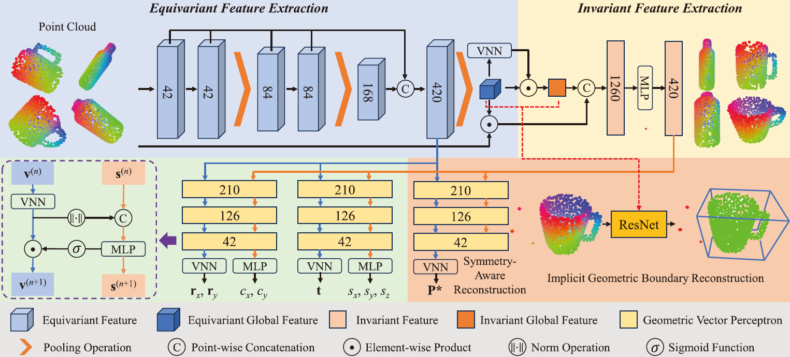

# SE(3)-Equivariance Learning for Category-level Object Pose Estimation
Pytorch implementation of SE(3)-Equivariance Learning for Category-level Object Pose Estimation.


## Installation

We suggest to create an Anaconda environment and install the dependencies:

```
conda create -y -n SE3Pose python=3.8
conda activate SE3Pose
pip install -r requirements.txt
```

## Data Preparation
Our data preparation leverages the code from this [git](https://github.com/mentian/object-deformnet).

Download [camera\_train](http://download.cs.stanford.edu/orion/nocs/camera_train.zip) ,[camera\_val](http://download.cs.stanford.edu/orion/nocs/camera_val25K.zip), [real\_train](http://download.cs.stanford.edu/orion/nocs/real_train.zip), [real\_test](http://download.cs.stanford.edu/orion/nocs/real_test.zip), [ground-truth annotations](http://download.cs.stanford.edu/orion/nocs/gts.zip), and [mesh models](http://download.cs.stanford.edu/orion/nocs/obj_models.zip) provided by [NOCS](https://github.com/hughw19/NOCS_CVPR2019).<br />

Unzip and organize these files in \$ROOT/data as follows:
```
    data
    ├── CAMERA
    │   ├── train
    │   └── val
    ├── Real
    │   ├── train
    │   └── test
    ├── gts
    │   ├── val
    │   └── real_test
    └── obj_models
        ├── train
        ├── val
        ├── real_train
        └── real_test
```
Modify and run python scripts to prepare the datasets.
```
    cd ./data_preprocess
    python shape_data.py
    python pose_data.py
```

## Training

Specify your path to NOCS dataset in  `config/config.py` and `dataloder/dataset.py`. Run python script to train.
```
    python train.py
``` 

We provide our pretrain model on [Google Drive](https://drive.google.com/file/d/141R70doQw6z0jJnyrYfrk-lDCJ8qZ8Zy/view?usp=sharing) for fast evaluation.
## Evaluation on NOCS dataset

Specify your path to NOCS dataset in  `config/config.py` and `evaluation/load_data_eval.py`. Run python script for evaluation.

```
    python train.py
```

## Evaluation on REDWOOD75 dataset

Get pose annotations from this [git](https://github.com/roym899/pose_and_shape_evaluation/blob/main/docs/data_preparation.md). Run python script for the evaluation on REDWOOD75 dataset.
```
    python redwood_eval.py
```

## Acknowledgment
Our implementation leverages the code from [VNN](https://github.com/FlyingGiraffe/vnn), [GPV-Pose](https://github.com/lolrudy/GPV_Pose), [HS-Pose](https://github.com/Lynne-Zheng-Linfang/HS-Pose).
